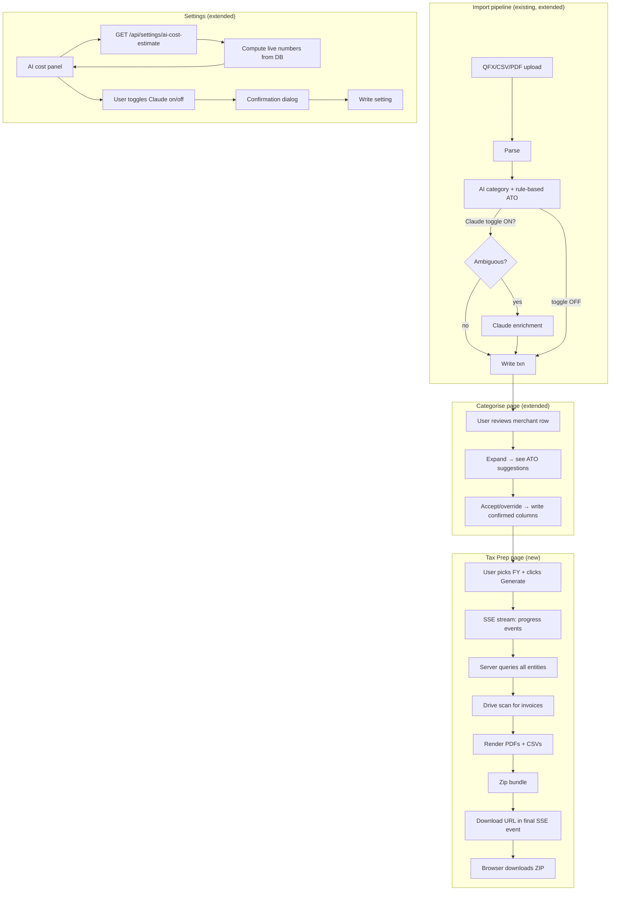

# Design — Phase F1: Tax Prep / Accountant Pack

This design doc covers screen breakdown, data flow, design decisions (DD-1 through DD-6), state management, UI patterns, accessibility, responsive behaviour, and requirement gaps. Technical implementation details (schema, API contracts, library pinning) are deferred to the Phase 3 technical spec.

## Screen / Component Breakdown

### `/financials/tax` — Tax Prep page (EXTENDS existing)

**Purpose:** Single hub for tax preparation work. Three tabs covering all the accountant-pack functionality.

**Covers ACs:** AC-008, AC-009, AC-010, AC-011, AC-012, AC-013, AC-014, AC-015, AC-016, AC-017, AC-018, AC-019, AC-020, AC-021, AC-022, AC-023

**Existing:** `src/components/financials/tax-tab.tsx` (flat list of deductibles)
**New structure:**
- `src/app/(dashboard)/financials/tax/page.tsx` — shell with PageHeader + FY selector + tabs
- `src/components/financials/tax/overview-tab.tsx` — per-entity summary cards, links to Categorise for unresolved items
- `src/components/financials/tax/invoices-tab.tsx` — list + drawer for invoice tagging
- `src/components/financials/tax/export-tab.tsx` — generate button, progress stream, export history
- `src/components/financials/tax/invoice-drawer.tsx` — side panel with file preview + tagging form
- `src/components/financials/tax/entity-summary-card.tsx` — one card per entity showing FY stats
- `src/components/financials/tax/fy-selector.tsx` — shared control

### `/financials/categorize` — Categorise page (EXTENDS existing)

**Purpose:** Add ATO code review to the existing merchant-level category workflow. AC-006, AC-007.

**Existing:** `src/components/financials/categorize-view.tsx` — merchant rows with expand-to-transactions
**New behaviour:** The existing expand row (click merchant → see its transactions) gains a new header panel above the transaction list showing:
- Merchant's current subcategory (read-only)
- AI-suggested personal ATO code (chip) + accept/override picker
- AI-suggested company ATO code (chip) + accept/override picker
- "Accept all AI" button (one click = accept category + personal ATO + company ATO for this merchant)
- "Why these codes?" info tooltip explaining rule-based logic

**No changes to the main merchant row** — daily flow stays untouched.

### `/settings` — Settings page (EXTENDS existing)

**Purpose:** Add the Claude AI toggle + cost estimate panel. AC-024, AC-025.

**New component:** `src/components/settings/ai-cost-panel.tsx` — shows the three live cost numbers, model/pricing assumptions, toggle control, confirmation dialog. Calls `GET /api/settings/ai-cost-estimate` to fetch the live numbers.

### `/settings/entities` — Entity edit form (EXTENDS existing)

**Purpose:** Add "Invoice Drive folder path" field to entity CRUD. AC-014.

**New field:** optional text input on the entity edit form, with a default placeholder `/Family Hub/Invoices/{entity-name}/FY{yy-yy}/`. Stored in a new `entities.invoice_drive_folder` nullable text column (schema change finalised in Phase 3).

## Data Flow



## Component Hierarchy

```
(dashboard)/financials/tax/page.tsx
└── <PageHeader> (shared)
└── <FYSelector>
└── <Tabs>
    ├── Tab: Overview
    │   └── <OverviewTab>
    │       ├── <EntitySummaryCard> × N
    │       │   ├── <StatCard> (shared)
    │       │   └── <OutstandingItemsList>
    │       └── <HealthPanel> (overall FY readiness score)
    ├── Tab: Invoices
    │   └── <InvoicesTab>
    │       ├── <EntitySelector>
    │       ├── <InvoiceList>           — left column
    │       │   └── <InvoiceRow> × N
    │       └── <InvoiceDrawer>         — right column (slide-in)
    │           ├── <PdfPreview>
    │           └── <InvoiceTagForm>
    │               └── <TransactionPicker>
    └── Tab: Export
        └── <ExportTab>
            ├── <EntityChecklist>       — which entities will be included
            ├── <GenerateButton>
            ├── <ExportProgress>        — SSE progress stream
            └── <ExportHistory>
                └── <ExportHistoryRow> × N

(dashboard)/financials/categorize/page.tsx
└── <CategorizeView> (existing, extended)
    ├── <MerchantRow> (existing)
    └── <MerchantExpanded>
        ├── <AtoCodePanel>              ← NEW
        │   ├── <AtoCodePicker> (personal)
        │   └── <AtoCodePicker> (company)
        └── <TransactionList> (existing)

(dashboard)/settings/page.tsx
└── existing sections
└── <AiCostPanel>                       ← NEW
    ├── <CostEstimateTable>
    ├── <ClaudeToggle>
    └── <ConfirmToggleDialog>
```

## Design Decisions Log

### DD-1 — Tax Prep page layout
- **Decision:** Option B — tabbed view (Overview / Invoices / Export)
- **Rationale:** Separates "what's going on" from "fix the gaps" from "ship it". Matches existing `financials-tabs.tsx` pattern. Each tab is a natural unit of work.
- **Date confirmed:** 2026-04-06
- **Impacts:** `/financials/tax/page.tsx` becomes a tab shell. Three new tab components. Existing `tax-tab.tsx` content migrates into `overview-tab.tsx`.

### DD-2 — ATO codes on Categorise page
- **Decision:** Option B — expandable detail row per merchant
- **Rationale:** Reuses the existing expand-to-show-transactions pattern in `categorize-view.tsx`. Zero clutter for daily categorisation. ATO UI only visible when engaged. Works at any screen width.
- **Date confirmed:** 2026-04-06
- **Impacts:** Extend the expanded row rendering in `categorize-view.tsx` with a new header panel (`<AtoCodePanel>`) above the transaction list. No changes to the main merchant row. New API endpoint for accepting/overriding ATO codes at the merchant level (propagates to all merchant transactions).

### DD-3 — Export generation flow
- **Decision:** Option B — streaming progress via SSE
- **Rationale:** Matches existing ingest pipeline SSE pattern (`IngestProgressEvent` in `src/types/financials.ts`). Handles large FYs without serverless timeout. Clear user feedback during 30–60s generation. No new infra — SSE is native to Next.js App Router.
- **Date confirmed:** 2026-04-06
- **Impacts:** Two API endpoints instead of one — `POST /api/financials/tax/export/start` (returns job ID) and `GET /api/financials/tax/export/{id}/stream` (SSE events). Temp ZIP storage via Vercel Blob or `/tmp` ephemeral — Phase 3 spec picks. Client needs an `EventSource`-based progress component.

### DD-4 — PDF rendering library
- **Decision:** Option A — `@react-pdf/renderer`
- **Rationale:** Best dev velocity for table-heavy multi-page reports. JSX components match codebase mental model. Server-safe and Vercel-friendly. Trade-off accepted: no Tailwind, use `StyleSheet.create`.
- **Date confirmed:** 2026-04-06
- **Impacts:** Phase 3 spec adds `@react-pdf/renderer` to dependencies. New lib module at `src/lib/financials/tax-pdf/` with report templates: `cover-sheet.tsx`, `entity-report.tsx`, shared components. If F2 later needs invoice merging, add `pdf-lib` as a secondary dependency.

### DD-5 — Invoice admin UI shape
- **Decision:** Option B — drawer on Tax Prep Invoices tab
- **Rationale:** Lives inside the Tax Prep workflow. Drawer affords a split pane (file list + file preview + tag form) — the standard pattern for file metadata tagging. Clean upgrade path for F2 (scanner replaces file preview with OCR-extracted data).
- **Date confirmed:** 2026-04-06
- **Impacts:** New components `invoices-tab.tsx`, `invoice-drawer.tsx`, `invoice-tag-form.tsx`, `transaction-picker.tsx`. PDF preview via `<iframe src={fileUrl}>` for PDFs and `` for JPG/PNG. New lightweight DB table `invoice_tags` (or extension of existing) with columns matching the invoices-index.csv schema — finalised in Phase 3.

### DD-6 — AI proposal source for ATO codes
- **Decision:** Option C — hybrid (rule-based default + Claude for ambiguous), **with mandatory user toggle and cost estimate** (added constraint)
- **Rationale:** Deterministic rule-based covers the 90% case for free. Claude handles the hard 10% (e.g. "Netflix" under Software & SaaS shouldn't get D5). User explicit control over cost. Default OFF — no surprise spend on upgrade.
- **Date confirmed:** 2026-04-06
- **Impacts:**
  - New Settings panel (`AiCostPanel`) with live cost estimates.
  - New API route `GET /api/settings/ai-cost-estimate` — computes (per-import cost, monthly cost, backfill cost) from current DB volume and Claude Haiku 4.5 pricing.
  - New setting `ai_claude_enabled_ato` (default false) in a new `user_settings` table or equivalent.
  - Ingest pipeline has two paths: pure rule-based (toggle OFF) vs hybrid (toggle ON, Claude called only for rows where rule-based returned null).
  - Surfaced requirement gap RG-1 → added AC-024/025/026 to requirements doc v0.2.

## State Management

- **Tax Prep page** — local React state per tab. No global store. FY selector state lives in URL search params so the page is shareable/bookmarkable: `/financials/tax?fy=2025-26&tab=export`.
- **Categorise page ATO panel** — existing `changes` Map in `categorize-view.tsx` is extended to accept `atoCodePersonal` and `atoCodeCompany` alongside `category`. Single save call commits all three fields for the merchant.
- **Export flow** — `useState` for `jobId`, `progressEvents[]`, `downloadUrl`, `error`. SSE `EventSource` in a `useEffect` that cleans up on unmount.
- **Invoice drawer** — local state for `selectedFile`, `formValues`, `saving`. No optimistic writes — save on blur/button click only.
- **Settings AI panel** — fetch cost estimate once on mount; no real-time updates; refetch on next page load.

## UI Decisions & Patterns

### Loading states
- **Tax Prep Overview tab:** skeleton cards for each entity while queries run
- **Invoices tab:** spinner over the file list area; drawer shows its own loading state when switching files
- **Export progress:** dedicated progress component (see below) — never a blank spinner during generation
- **Settings AI panel:** skeleton for the three cost numbers; show "~estimating…" placeholder until fetch completes

### Empty states (use shared `<EmptyState>`)
- **No transactions for FY:** "No transactions found for FY 2025-26" + link to Import
- **No entities configured:** "No entities yet" + link to Settings → Entities
- **No outstanding items:** ✓ "All items resolved for FY 2025-26"
- **No invoices in Drive folder:** "No files found. Check your Drive folder path in Settings." + link
- **No export history:** "No exports yet. Click Generate to create your first accountant pack."

### Error states
- **Drive scan fails (AC-015):** inline error on Invoices tab with retry; export can still proceed without invoices (degraded)
- **Claude call fails (AC-024 path):** log error, fall back to rule-based for that transaction, continue ingest; surface in ingest summary
- **PDF generation fails:** show error in SSE progress stream; offer "Retry generation" button; don't leave temp files behind
- **Cost estimate API fails:** show "Could not load cost estimate — refresh to retry", disable the toggle until estimate loads

### Success feedback
- **Export complete:** full-screen celebration card with the download link + "Open folder" button if browser supports + "View history" link
- **Categorise save with ATO codes:** toast "Saved: 15 categories, 15 personal ATO codes, 3 company ATO codes"
- **Settings toggle flipped:** toast "Claude AI enabled — next import will use enhanced proposals"

### Progress component (`<ExportProgress>`)
Matches existing ingest-panel style:
```
Generating Accountant Pack — FY 2025-26
──────────────────────────────────────────
✓ Querying Personal transactions      (320 found)
✓ Querying D3 Pty Ltd transactions    (1,204 found)
⟳ Rendering D3 report PDF…            page 2 of 4
○ Rendering Babyccino report PDF
○ Scanning Drive folders
○ Building ZIP
──────────────────────────────────────────
Elapsed: 00:24     [Cancel]
```

### Cost estimate panel (`<AiCostPanel>`)
```
┌─ Claude AI — ATO Code Proposals ────────────────────────┐
│                                                         │
│  Model: Claude Haiku 4.5                                │
│  Pricing: $1.00 per 1M input tokens,                    │
│           $5.00 per 1M output tokens (April 2026)       │
│                                                         │
│  Your estimated cost:                                   │
│  ┌─────────────────┬─────────┬────────────┐            │
│  │ Per import      │ Monthly │ Backfill   │            │
│  │ ~$0.07          │ ~$0.35  │ ~$7.50     │            │
│  │ (100 txns)      │ (500/mo)│ (10,200   │            │
│  │                 │         │ existing)  │            │
│  └─────────────────┴─────────┴────────────┘            │
│                                                         │
│  [  ●  Claude AI OFF  ]   ← click to enable             │
│                                                         │
│  ⓘ When OFF, rule-based proposals from the xlsx        │
│    mapping cover ~90% of cases. Claude handles         │
│    ambiguous rows only (e.g. Netflix under SaaS).      │
└─────────────────────────────────────────────────────────┘
```

## Accessibility

- All tabs keyboard-navigable (arrow keys within tab list, tab to leave)
- PDF preview has `alt` / `aria-label` describing the filename and supplier
- ATO code pickers have visible labels, not just placeholder text
- Cost estimate numbers announced as a live region for screen readers on load
- Confirmation dialog on Claude toggle is a proper `<dialog>` with focus trap and Esc-to-close
- Export progress is announced via `aria-live="polite"` as each step completes
- Drawer opens with focus on the first form field; close returns focus to the clicked row
- All actionable icons have `aria-label` (Cancel export button, Drawer close, Retry)

## Responsive Behaviour

- **Tax Prep page — desktop (≥1024px):** Full tabbed layout with 3-column entity grid on Overview, split-pane invoice drawer on Invoices tab
- **Tax Prep page — tablet (768–1024px):** Entity grid collapses to 2 columns; invoice drawer becomes a modal instead of split-pane
- **Tax Prep page — mobile (<768px):** Tabs become a vertical list selector; entity grid is 1 column; invoice drawer is full-screen modal; Export tab generate button is full-width
- **Categorise page:** no changes — existing responsive behaviour preserved; the new expanded ATO panel follows the same breakpoints as the existing expanded-transactions row
- **Settings AI panel:** the cost estimate grid stacks vertically on mobile
- **Per AC scope:** out-of-scope for mobile EXPORT flow (EC-7 = out of scope), but all the prep screens (Overview, Invoices, Categorise) remain usable on mobile for in-year work

## Requirement Gaps Found During Design

- **RG-1 — Claude AI toggle + cost transparency** — resolved by hot-patching requirements doc to v0.2 with AC-024, AC-025, AC-026
- **RG-2 — Entity `invoice_drive_folder` column** — not explicitly called out in requirements but needed for AC-014. Adding to Phase 3 spec as a schema change.
- **RG-3 — `user_settings` table (or equivalent)** — needed to persist the Claude toggle. Phase 3 spec decides whether this is a new table, a JSON column on `users`, or an env-var-like singleton table.
- **RG-4 — Export job state persistence** — requirements say "no concurrent export handling" (EC-8 out of scope) but SSE + temp storage still need a lightweight job registry. Phase 3 spec chooses DB table vs in-memory map.
- **RG-5 — Invoice tagging persistence** — requirements don't specify where `invoice_tags` live (in DB vs only in the generated CSV). Phase 3 spec decides. Recommend: DB table keyed by Drive file ID so tags survive across exports.

## Out of Scope (restated)

Confirmed during design — nothing added beyond what's already in requirements doc:
- Mobile Export flow
- Concurrent admin exports
- Offline support
- Rolling 12-month (non-FY) reports
- Invoice Scanner full integration (Phase F2)
- Balance sheet snapshot
- Per-transaction ATO override UI at transaction detail page
- Loan principal/interest split
